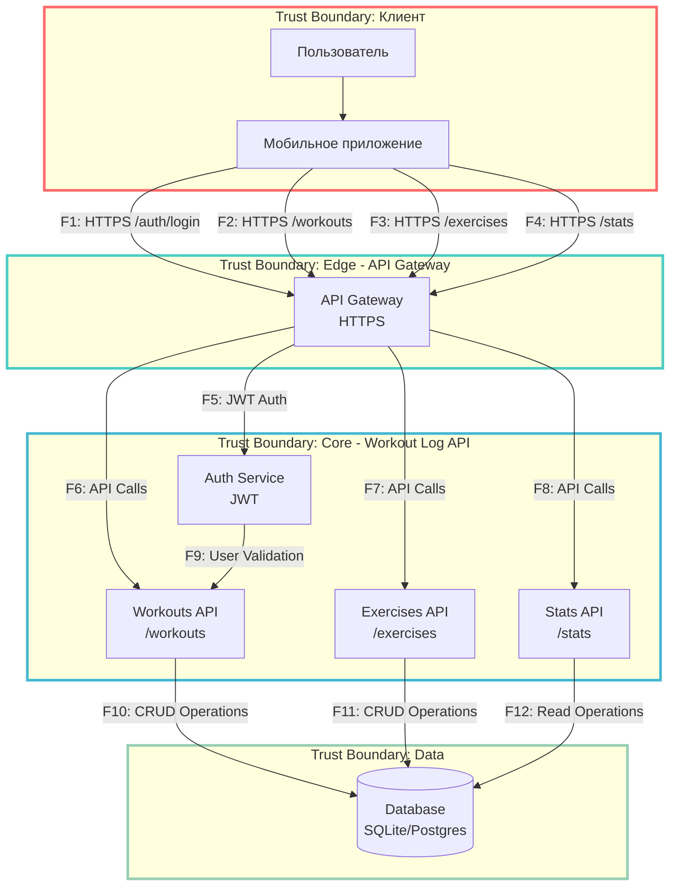

# DFD - Workout Log Threat Model

## Контекстная диаграмма Workout Log API

## Описание потоков данных

| Flow ID | Описание | Канал/Протокол | Данные |
|---------|-----------|-----------------|--------|
| F1 | Аутентификация пользователя | HTTPS/JSON | email, password |
| F2 | Запросы тренировок | HTTPS/JSON | workout data, user_id |
| F3 | Запросы упражнений | HTTPS/JSON | exercise data, workout_id |
| F4 | Запросы статистики | HTTPS/JSON | user_id, date range |
| F5 | Валидация JWT токена | Internal | JWT token verification |
| F6 | API Calls тренировки | Internal/JSON | workout operations |
| F7 | API Calls упражнения | Internal/JSON | exercise operations |
| F8 | API Calls статистика | Internal/JSON | stats operations |
| F9 | Проверка прав доступа | Internal | user_id, resource_id |
| F10 | Операции с БД тренировки | SQL | workout CRUD |
| F11 | Операции с БД упражнения | SQL | exercise CRUD |
| F12 | Read Operations статистики | SQL | stats queries |
